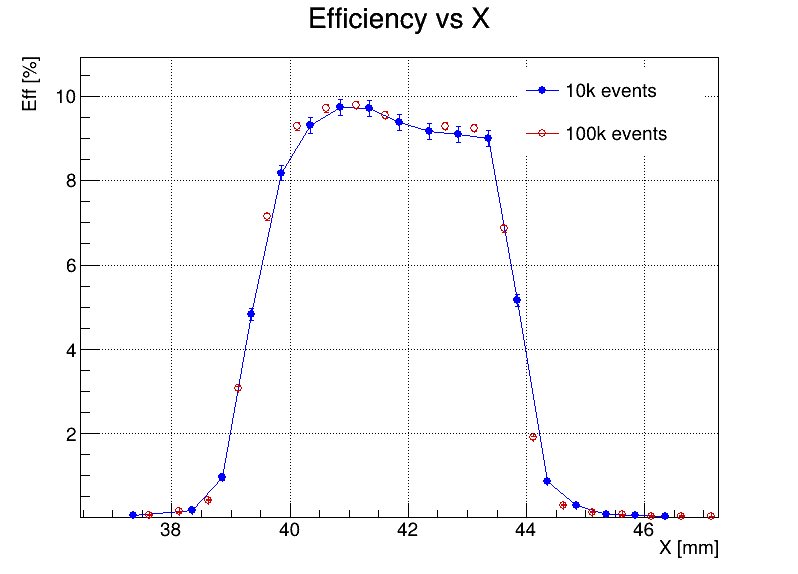

# Photon Detection Efficiency (PDE) Analysis

## Overview
This module quantifies the single-pixel Photon Detection Efficiency (PDE) across the surface of Large Area Picosecond Photodetectors. It processes digitized waveforms captured during automated optics scanning, evaluates trigger efficiencies, and generates spatial performance profiles.

## Analysis Workflow

### 1. Hardware Control & Data Acquisition
The scanning process is fully automated using Python (see the `Automated_Optics_Scanner.py` script in the `/Hardware_Control` directory). The system precisely controls Zaber position stages and triggers LED light sources to capture waveform data across specific spatial coordinates.

### 2. Batch Waveform Processing
The `Batch_Waveform_Analyzer.py` script batch-processes the raw acquisition directories. It interfaces with C++ waveform reading tools to extract Analog-to-Digital (ADC) and Charge-to-Digital (QDC) peak histograms for every targeted spatial coordinate.

### 3. PDE Calculation and Profiling
The `Calculate_PDE_Profile.cpp` ROOT script ingests the generated histograms. It calculates the localized efficiency by comparing the registered ADC peaks against the total trigger count, producing an absolute efficiency mapping across the scanned axis.


*Figure: Spatial scan demonstrating Photon Detection Efficiency (PDE) as a function of the X-axis coordinate across the photodetector surface.*

## Usage
To execute the automated analysis and plotting pipeline:

```bash
# 1. Run the batch analyzer on raw run directories
python Batch_Waveform_Analyzer.py

# 2. Generate the efficiency plots
root -l -q Calculate_PDE_Profile.cpp
```
