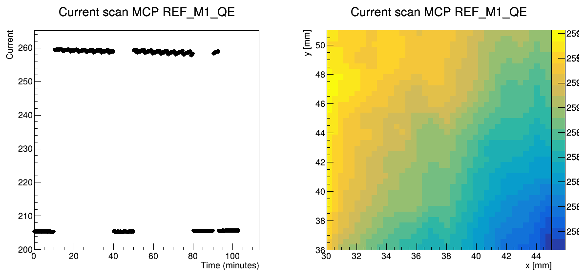
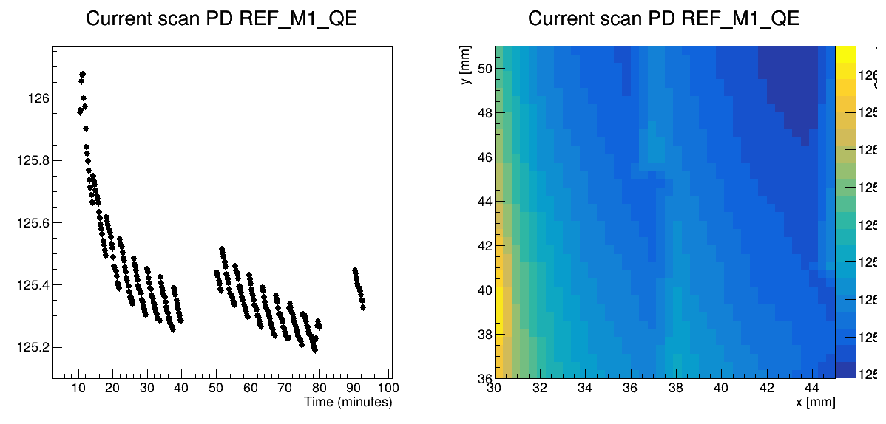
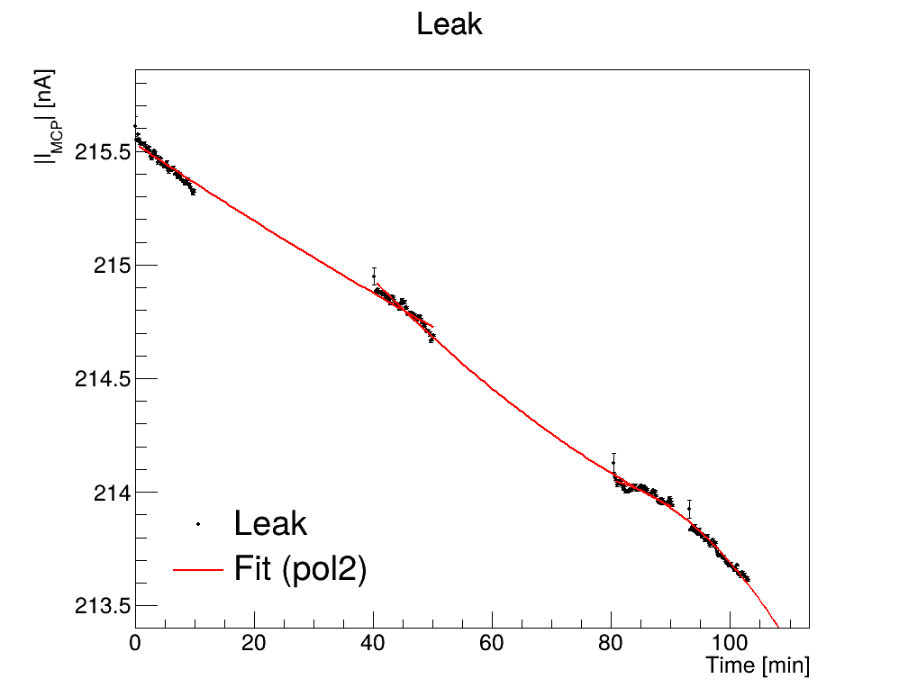
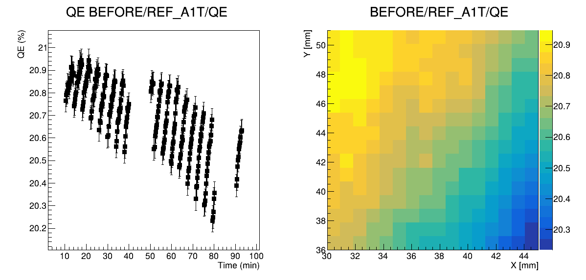
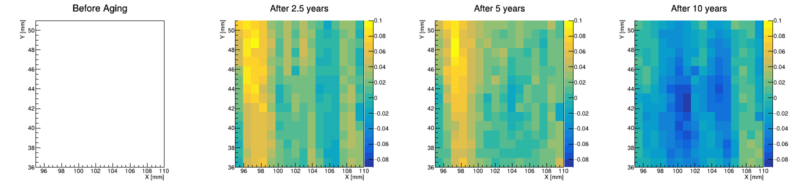

# Quantum Efficiency (QE) Analysis Pipeline

## Overview
This module contains the C++ and ROOT-based analysis pipeline used to characterize the Quantum Efficiency (QE) of Large Area Picosecond Photodetectors (HRPPDs). It processes raw hardware telemetry from Keithley instruments, isolates the true signal from background leakage current, and generates spatial efficiency maps.

## Expected Input Data Structure
The analysis scripts are designed to process directories containing hundreds of raw Keithley output files (e.g., `.dat` or `.txt`). Due to file size and repository limits, raw datasets are not hosted here. 

To use this pipeline, point the scripts to a local directory containing your instrument outputs. The code expects two types of measurement files:
* **Background/Leakage Files (e.g., `MCP_leak_*.dat`):** Measurements taken with the light source OFF to establish the baseline dark current.
* **Active QE Files (e.g., `QE_MCP_X*_Y*.dat`):** Measurements taken with the light source ON at specific spatial coordinates to capture the true signal.

**Data Handling Logic:**
Each individual file contains a 10-second recording of continuous current measurements. The parsing scripts automatically read all ~500 files in the target directory, average the 10-second recordings to generate a single robust data point per file, and aggregate them to construct the full 2D spatial map.

## Analysis Workflow

### Step 1: Data Parsing & Distribution Extraction
The pipeline begins by parsing the raw output files. The `ReadQEscanXY.cpp` and `ReadQEaverage.cpp` scripts sort the telemetry into three main components:
* **Microchannel Plate (MCP) Current**
* **Photodiode (PD) Current**
* **Background Leakage Current**

These values are extracted and stored as ROOT `TGraphs` to visualize the raw photocurrent distributions across the detector surface.


*Figure: Measured MCP Photocurrent Distribution.*


*Figure: Measured Photodiode (PD) Photocurrent Distribution.*

### Step 2: Background Noise Isolation
To accurately calculate QE, the background noise must be isolated and subtracted from the signal. The `PlotQEscanXY.c` and `PlotQEaverage.c` scripts automatically apply mathematical fits to the leakage current for every measurement interval. 


*Figure: Fitting the background leakage current over specific time intervals to isolate the true detector signal.*

### Step 3: QE Calculation and Spatial Mapping
With the background leakage accurately modeled, the pipeline calculates the true Quantum Efficiency using the following calibration formula:

$$QE = \frac{I_{MCP} - I_{leak}}{I_{PD}} \times \frac{CC}{SR} \times QE_{calibrated}$$

The scripts then plot the final fits, residuals, and the resulting QE measurements, outputting them into a finalized `.root` file. 


*Figure: Baseline Quantum Efficiency measurement extracted from the corrected signal.*


*Figure: 2D Spatial Map demonstrating the calculated Quantum Efficiency across the detector surface.*

## Usage
To run the full spatial scan analysis via the command line:

```bash
# 1. Parse the raw Keithley data into TGraphs
root -l -q 'ReadQEscanXY.cpp("path/to/Measurements")'

# 2. Fit the leakage current and calculate the 2D QE Map
root -l -q 'PlotQEscanXY.c("output_TGraphs_file.root")'
```
